<h2 align="center">
</h2>

Experienced Full-stack Developer with a strong passion for scalable web and mobile development, specializing in working with start-up companies. Continuously driven to expand knowledge and actively contribute to the growth and success of others.

 

  
  
  
  
  
  

 

---

 
<h3 align="center">🏆 Github Profile Trophy</h3>
 

 
 

 
 

---

 

### Skills
- 🌱 Frontend : React, Next.js, React Native, Angular, Vue3, Nuxt.js, Flutter, Ionic, Electron, Bootstrap, TailwindCSS
- 🔭 Backend : Express, Nest.js, Django, Flask
- 🧩 Database : MySQL, PostgreSQL, MongoDB, DynamoDB, Firestore, MariaDB, SQLite
- 💬 Language : HTML, CSS, Javascript, Typescript, Python, PHP, Dart
- ⚡ Cloud & DevOps : AWS, GCP, Docker
- 📫 Testing : Jest, Enzyme, Cypress

 

### Tools
<code></code>
<code></code>
<code></code>
<code></code>
<code></code>
<code></code>
<code></code>
<code></code>
<code></code>
<code></code>
<code></code>
<code></code>
<code></code>
<code></code>
<code></code>
<code></code>
<code></code>
<code></code>
<code></code>
<code></code>
<code></code>
<code></code>
<code></code>
<code></code>
<code></code>
<code></code>
<code></code>
<code></code>
<code></code>
<code></code>
<code></code>
<code></code>
<code></code>
<code></code>
<code></code>
<code></code>
<code></code>
<code></code>

<!--
**bigsmall2697/bigsmall2697** is a ✨ _special_ ✨ repository because its `README.md` (this file) appears on your GitHub profile.

Here are some ideas to get you started:

- 🔭 I’m currently working on ...
- 🌱 I’m currently learning ...
- 👯 I’m looking to collaborate on ...
- 🤔 I’m looking for help with ...
- 💬 Ask me about ...
- 📫 How to reach me: ...
- 😄 Pronouns: ...
- ⚡ Fun fact: ...
-->
